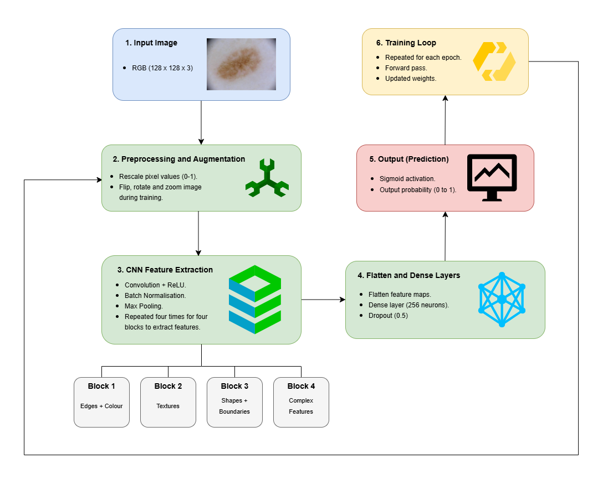
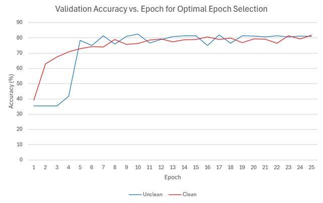
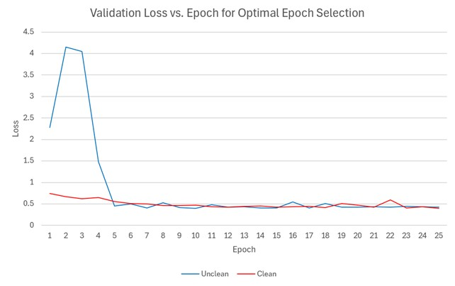
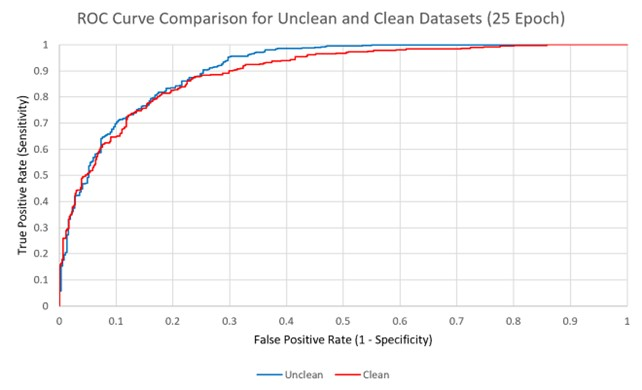
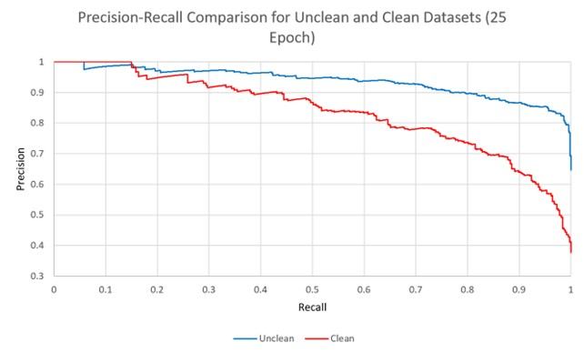
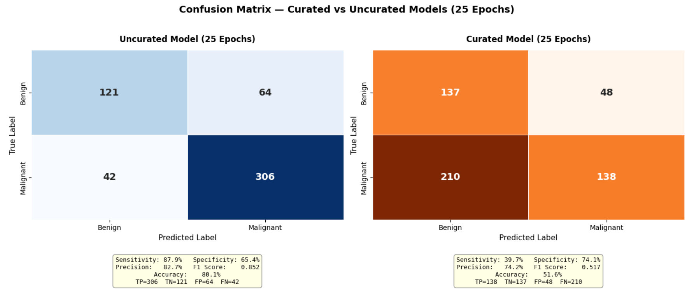

# AI and Machine Learning-Based Skin Cancer Classification

## Project Overview
The NHS receives approximately 1.2 million annual referrals for skin cancer, with only 659 dermatologists in England. 60% are considered urgent, but only 6% classified as malignant, which causes unnecessary strain on the NHS. This group project aimed to reduce the number of unnecessary referrals by developing a mobile application, intended as a tool for general practitioners (GPs), to classify benign and malignant skin lesions.

Current models have shown potential for diagnostic support; however, there are concerns about transparency in results and bias towards lighter skin tones due to the lack of diversity in training datasets. Therefore, the project also investigated approaches to mitigate these common issues.

## My Contribution
The key responsibilities for my role was as follows:
- Developed a machine learning classification model to classify skin lesions, using deep learning for automatic feature extraction.
- Curated a high-quality, clean image dataset to train a machine learning model.
- Collected an equal number of unclean images to run through the model and compare results.
- Ran both datasets through the model and obtained metrics for model performance.
- Optimised model parameters to assess their impact on performance.

## Methodology
The information below shows the project workflow for my role:
1. Conducted a literature review looking at human assessments of skin cancer, existing technologies, deep learning algorithms in medical settings, key model parameters, and medical device regulations.
2. Collected 200 skin lesion images to train an initial classification model, provided by the project supervisor.
3. Curated a larger dataset of approximately 6000 images, equal parts benign and malignant.
4. Cleaned the dataset by removing images with significant obstructions and low-quality.
5. Separate images into two datasets - unclean and clean.
6. Develop a sequential convolutional neural network (CNN) architecture, use the Keras ImageDataGenerator for image preprocessing, and introduce parameters such as batch normalisation, convolutional blocks and dropout.
7. Run both datasets through the model and obtain performance metrics.
8. Adjust parameters and rerun the datasets through the model for potential improvements in accuracy.
9. Report on the results obtained for both datasets and comment on the optimal epoch for model performance.

## Results
### Optimal Epoch
Firstly, the optimal epoch was found at 25, providing the best balance between accuracy and computational efficiency. The figures below illustrate the validation accuracy and validation loss against epoch.

### Performance Metrics
The table below shows a table of each performance metric for both datasets at 25 epochs. The unclean dataset outperformed the clean dataset on most metrics, but the clean dataset showed superior specificity and false positive rate.

| Metric | Uncurated Model | Curated Model | Higher-Performing Model |
|---|---:|---:|---|
| Accuracy | 80.1% | 51.6% | Uncurated |
| Sensitivity | 87.9% | 39.7% | Uncurated |
| Specificity | 65.4% | 74.1% | Curated |
| Precision | 82.7% | 74.2% | Uncurated |
| F1 Score | 0.852 | 0.517 | Uncurated |

### ROC Curve
The figure below shows the ROC curve for both datasets, from which the area under the curve (AUC) provides a measure of the performance at all classification thresholds.

The AUC of the unclean dataset (0.91) slightly outperformed the clean dataset (0.89), suggesting higher model performance across lenient and strict criteria.

### Precision-Recall Curve
The precision-recall curve shown below indicates how well the model maintains true positive predictions while minimising false positives, using average precision (AP) to combine this into one value.

The AP of the model was higher on the unclean dataset, at 0.94 compared to 0.84 for the clean dataset, suggesting that the model could more consistently identify malignancy while rarely misclassifying benign lesions in the unclean dataset.

### Confusion Matrices
A direct comparison of true positives, true negatives, false positives, and false negatives, for both datasets can be seen in the confusion matrices below. 

The true negative rate for the clean dataset was significantly higher than the unclean dataset; however, the false negative rate was also higher, suggesting that the model had established a stricter malignant criteria for the clean dataset. The model correctly identified many more malignant cases on the unclean dataset, with a slightly higher number of false positives. Overall, the model performed at a higher accuracy on the unclean dataset.

## Future Work
- Use international databases to collect skin lesion images for a more even skin tone distribution.
- Update the model to perform multi-classification of benign and malignant subtypes.
- Adjust parameters other than epoch to study effect on performance and maximise accuracy.

## Author
**Jatinder Dhaliwal**

MEng Biomedical Engineering Graduate, Queen Mary University of London

**Acknowledgements**

My contributions were completed as part of a group project. I would like to acknowledge the efforts of my team members towards the project's success:

- Gurtej Panesar - Helped with model development and dataset curation, performed bias monitoring.
- Nadia Mohammad - Developed user interface (UI) of the mobile application.
- Kennasa Ahmed - Incorporated XAI alongside model classification, combined front-end and back-end.
- Emily Speed - Created image preprocessing pipeline and U-Net segmentation model.
- Holly Azarinejad - Continuously tracked classification performance over time, highlighting model drift.

**Profiles**

GitHub: [Jatinder Dhaliwal](https://github.com/jatinder-d)

LinkedIn: www.linkedin.com/in/jatinderdhaliwal
